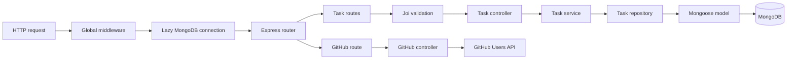

# Task Manager Backend

The backend is an Express REST API for task persistence and GitHub profile lookup. It stores tasks in MongoDB through Mongoose, validates task mutations with Joi, applies CORS and request parsing globally, and logs requests and application errors.

## Features

- Create, list, update, complete, and delete tasks.
- Return tasks newest first.
- Validate task mutation payloads and MongoDB object IDs.
- Proxy public GitHub user profile requests.
- Restrict browser origins with configurable CORS rules.
- Connect to MongoDB lazily when an API request arrives.
- Produce HTTP request logs and structured application logs.
- Return JSON responses for API errors and unmatched routes.

## Architecture

Task operations follow a route-controller-service-repository structure. The GitHub module is smaller: its controller calls the external API directly because it has no persistence layer.



Every route, including the root status route, passes through the database connection middleware before its handler runs.

## Tech Stack

| Area                   | Implementation                                              |
| ---------------------- | ----------------------------------------------------------- |
| Runtime                | Node.js with ES modules                                     |
| Framework              | Express 4                                                   |
| Language               | JavaScript                                                  |
| Database               | MongoDB                                                     |
| Data modeling          | Mongoose 8                                                  |
| Request validation     | Joi 17                                                      |
| Environment validation | envalid with dotenv loading                                 |
| CORS                   | `cors` middleware                                           |
| HTTP logging           | Morgan                                                      |
| Application logging    | Winston                                                     |
| Error creation         | `http-errors`                                               |
| Development server     | Nodemon                                                     |
| Testing                | Node.js built-in test runner; no test files currently exist |
| Formatting and linting | Prettier and ESLint 9                                       |
| Package manager        | npm (`package-lock.json`)                                   |

The implementation has no authentication, authorization, file storage, email delivery, queue, cache, WebSocket, or generated API-documentation subsystem.

## Project Structure

```text
backend/
├── src/
│   ├── api/
│   │   ├── github/
│   │   │   ├── github.controller.js
│   │   │   └── github.routes.js
│   │   ├── task/
│   │   │   ├── task.controller.js
│   │   │   ├── task.dto.js
│   │   │   ├── task.model.js
│   │   │   ├── task.repository.js
│   │   │   ├── task.routes.js
│   │   │   └── task.service.js
│   │   └── index.js           # Root router and database connection
│   ├── config/
│   │   └── env.config.js      # Validated core environment settings
│   ├── lib/
│   │   ├── database.lib.js    # Mongoose connection management
│   │   ├── logger.lib.js      # Winston logger
│   │   └── promise.lib.js     # Async middleware wrapper
│   ├── middlewares/
│   │   ├── global.middleware.js
│   │   └── validation.middleware.js
│   └── app.js                 # Express application entry point
├── .env.example
├── nodemon.json
├── vercel.json
├── eslint.config.js
└── package.json
```

## Installation

Run these commands from the repository root:

```bash
cd backend
npm install
```

Create `.env` from `.env.example` and provide a reachable MongoDB connection string.

## Environment Variables

| Variable          | Required             | Description                                                       | Example                                 |
| ----------------- | -------------------- | ----------------------------------------------------------------- | --------------------------------------- |
| `NODE_ENV`        | No                   | `development`, `test`, or `production`; defaults to `development` | `development`                           |
| `PORT`            | Production-dependent | HTTP listening port; development default is `5000`                | `5000`                                  |
| `MONGODB_URI`     | Yes                  | MongoDB connection string used by Mongoose                        | `mongodb://localhost:27017/taskmanager` |
| `FRONTEND_URL`    | No                   | Single allowed browser origin when `ALLOWED_ORIGINS` is absent    | `http://localhost:3000`                 |
| `ALLOWED_ORIGINS` | No                   | Comma-separated list that overrides `FRONTEND_URL`                | `http://localhost:3000`                 |
| `VERCEL`          | Platform-provided    | Disables file logging when set by Vercel                          | `1`                                     |

`NODE_ENV`, `PORT`, and `FRONTEND_URL` are validated by envalid. `MONGODB_URI` is checked when the first request triggers a database connection. `ALLOWED_ORIGINS` is split and trimmed at request time.

## Database Setup

1. Start a local MongoDB server or provision a remote MongoDB database.
2. Set `MONGODB_URI` in `backend/.env`.
3. Start the API and send a request; the router connects to MongoDB before handling it.

The task schema is defined in `src/api/task/task.model.js`:

| Field         | Type    | Behavior                     |
| ------------- | ------- | ---------------------------- |
| `title`       | String  | Required and trimmed         |
| `description` | String  | Optional and trimmed         |
| `completed`   | Boolean | Defaults to `false`          |
| `createdAt`   | Date    | Added by Mongoose timestamps |
| `updatedAt`   | Date    | Added by Mongoose timestamps |

Tasks are independent documents with no declared relationships. The repository contains no migration or seed framework, files, or package scripts; Mongoose creates the collection when data is first written.

## Running Locally

```bash
npm run dev
```

Nodemon watches `src` and `.env`, then executes `node ./src/app.js`. The API listens on `http://localhost:5000` with the example environment.

## Available Scripts

| Command                | Purpose                                      |
| ---------------------- | -------------------------------------------- |
| `npm run dev`          | Start the API with Nodemon                   |
| `npm run start`        | Start the API with Node.js                   |
| `npm run lint`         | Lint JavaScript files                        |
| `npm run format`       | Format supported project files with Prettier |
| `npm run format:check` | Check formatting without writing changes     |
| `npm test`             | Run the Node.js test runner                  |

## Production Operation

There is no transpilation or production build script. Production runs the JavaScript source directly:

```bash
npm run start
```

Set `NODE_ENV=production`, provide `PORT`, `MONGODB_URI`, and the production CORS origin configuration before starting the process.

## API Overview

All endpoints accept and return JSON except endpoints without request bodies.

| Method   | Endpoint                | Description                               | Validation                           |
| -------- | ----------------------- | ----------------------------------------- | ------------------------------------ |
| `GET`    | `/`                     | API status response                       | None                                 |
| `GET`    | `/api/tasks`            | Return all tasks, newest first            | None                                 |
| `POST`   | `/api/tasks`            | Create a task                             | Create-task Joi schema               |
| `PUT`    | `/api/tasks/:id`        | Update one or more task fields            | Object ID and update-task Joi schema |
| `DELETE` | `/api/tasks/:id`        | Delete a task                             | Object ID                            |
| `GET`    | `/api/github/:username` | Return a normalized public GitHub profile | None                                 |

Create request body:

```json
{
  "title": "Write documentation",
  "description": "Update both project READMEs"
}
```

Update requests accept any non-empty combination of `title`, `description`, and `completed`.

Successful task and GitHub data responses use this envelope:

```json
{
  "success": true,
  "data": {}
}
```

No OpenAPI or Swagger configuration is wired into the application.

## Authentication and Authorization

The API has no authentication middleware, token/session handling, user model, roles, ownership checks, or protected routes. Every endpoint is public to clients that can reach the service and satisfy its CORS policy. CORS controls browser origins; it is not an authentication mechanism.

## Validation

- `POST /api/tasks` requires a trimmed, non-empty string `title`; `description` is optional and may be empty.
- `PUT /api/tasks/:id` requires at least one recognized field. `title` and `description` follow the create rules, and `completed` must be boolean.
- Joi reports all payload issues in one response because validation uses `abortEarly: false`.
- Update and delete handlers reject malformed MongoDB object IDs before calling the service layer.
- Mongoose validators run during updates through `runValidators: true`.

## Error Handling

Async failures are forwarded to the final Express error middleware. It logs the response details and returns `status`, `message`, and `stack`; stack traces are included only in development. Unknown routes return HTTP 404 with `Endpoint not found`. Missing tasks return HTTP 404, malformed task IDs return HTTP 400, and GitHub failures are mapped to HTTP 404 or 502.

## Logging

- Morgan writes development-style HTTP request logs.
- Winston logs to the console at `debug` level outside production and `warn` level in production.
- Production application logs are JSON; development logs are timestamped and colorized.
- Outside Vercel, Winston also writes errors to `logs/error.log`.
- When `VERCEL` is set, file logging is disabled and only the console transport is used.

## External Services

`GET /api/github/:username` calls `https://api.github.com/users/:username` with GitHub's v3 JSON accept header. It returns the login, display name, avatar URL, profile URL, repository count, follower count, and following count. The integration does not use a GitHub token, so GitHub's unauthenticated rate limits apply.

## Deployment

`vercel.json` configures `src/app.js` with `@vercel/node` and routes all incoming paths to that entry point. When deploying this repository to Vercel, use `backend` as the project root and configure the production environment variables in the platform.

No Docker, Docker Compose, PM2, reverse-proxy, or CI/CD configuration exists in the backend repository.

## Troubleshooting

### Requests fail before reaching a route

Every request attempts to connect to MongoDB first. Verify `MONGODB_URI`, database availability, DNS/network access, and any hosted-database allowlist.

### The browser reports a CORS error

Set `FRONTEND_URL` for one frontend or provide all allowed origins in comma-separated `ALLOWED_ORIGINS`. Origins must match exactly, including protocol and port.

### The server exits during startup

Check that `NODE_ENV`, `PORT`, and `FRONTEND_URL` satisfy the envalid rules. Production does not receive the development default for `PORT`.

### GitHub lookup returns HTTP 502

The GitHub API returned a non-success response other than 404. Check outbound network access and GitHub's unauthenticated rate limit.

## Code Review & Architecture Questions

### 1. What steps would you take to secure this web application?

I would treat the Express API as the security boundary because the Next.js client and every REST task endpoint are public. The API already validates task payloads with Joi and object IDs before Mongoose queries; I would add rate limiting, Helmet security headers, request-size limits, and stricter validation for the GitHub username route. CORS would allow only the deployed frontend origins through `ALLOWED_ORIGINS` or `FRONTEND_URL`, while recognizing that CORS is not authentication.

For multi-user use, I would add authentication and enforce task ownership in the service and repository layers. Vercel would hold `MONGODB_URI` and other server-only settings; only the intentionally public `NEXT_PUBLIC_API_URL` belongs in the frontend bundle. Production errors should omit stack traces, logs should exclude secrets, MongoDB access should use a least-privilege database user and network allowlist, and the GitHub Public API proxy should handle rate limits without exposing tokens.

### 2. How would you improve the performance of this application?

I would measure the browser, Next.js server render, Express response time, and MongoDB query time separately. The current task list is small, so React memoization or virtualization would add complexity without evidence. The first useful changes would be adding a MongoDB index that supports the newest-first task query, limiting or paginating `GET /api/tasks`, and avoiding an unconditional database connection attempt for the GitHub route.

On the frontend, I would preserve the Next.js server-rendered initial list, keep mutation state local, and use optimistic updates only with rollback on API failure. If profiling shows unnecessary renders, I would split state by task or stabilize callbacks at that point. Tailwind CSS already produces a small utility stylesheet, and Next.js `Image` handles GitHub avatars. I would also cache successful GitHub Public API responses briefly in the Express layer to reduce latency and unauthenticated rate-limit pressure, then compare production Core Web Vitals and API percentiles before and after each change.

### 3. Why is MongoDB appropriate here, and when would you choose SQL instead?

MongoDB fits this application because each task is a self-contained document with a title, description, completion flag, and Mongoose timestamps. The REST task APIs mostly create, read, update, or delete one document, so the model does not require joins or complex transactions. Mongoose adds a defined schema and validation while retaining MongoDB's document-oriented storage.

I would choose PostgreSQL or another SQL database if the product added users, teams, task assignments, labels, billing, audit records, or reports with strong relationships and cross-record consistency requirements. Foreign keys, joins, and transactional constraints would then make those invariants explicit. MongoDB can model those features, but the decision should follow query patterns and integrity requirements rather than assuming NoSQL is inherently more scalable. In the current scope, MongoDB keeps persistence simple; the GitHub profile data is fetched from the GitHub Public API and is not stored locally.

### 4. How would you deploy and operate this full-stack application?

I would deploy the Next.js frontend and Express backend as separate Vercel projects connected to their respective repositories, with MongoDB hosted by a managed provider. The frontend build receives `NEXT_PUBLIC_API_URL=https://<backend-host>/api`. The backend receives `NODE_ENV=production`, `MONGODB_URI`, and explicit CORS configuration through `ALLOWED_ORIGINS` or `FRONTEND_URL`; `PORT` remains available for non-Vercel hosts. No secret value or MongoDB URI should be committed.

After deployment, I would verify all REST task APIs and the GitHub lookup from the production browser, including CORS preflights and error paths. CI should run linting and production builds before deployment. Operationally, I would add structured request/error monitoring, uptime checks, MongoDB backups and restore tests, dependency updates, and alerts for elevated API errors or GitHub rate-limit failures. Preview deployments should use isolated configuration and must not receive production database credentials unless explicitly required.

## License

The backend package metadata declares the ISC license. No separate license file is included in this repository.
